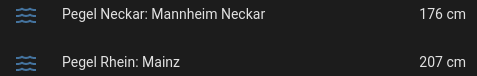
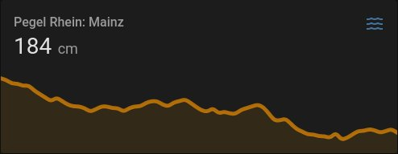

# PEGELONLINE Component for Home Assistant

[Home Assistant](https://www.home-assistant.io/) component that retrieves current water levels for German water bodies
from the [PEGELONLINE](https://www.pegelonline.wsv.de/) web service.

PEGELONLINE provides a [REST API](https://www.pegelonline.wsv.de/webservice/dokuRestapi) that is free to use.

## Setup

Currently, only manual installation is possible, HACS support is planned for the future.

### Manual Setup

Copy the folder `custom_components/pegelonline` to `<ha_config_dir>/custom_components/`. When you are done you should
have `<ha_config_dir>/custom_components/pegelonline/__init__.py`
, `<ha_config_dir>/custom_components/pegelonline/sensor.py` and so on.

If you use this method then you'll need to keep an eye on this repository to check for updates.

## Configuration

In Home Assistant:

1. Enter configuration menu
2. Select "Integrations"
3. Click the "+" button on the bottom right
4. Select the "PEGELONLINE" integration
5. Choose the stream gauge you wish to monitor (it's a long list; stations are grouped by rivers)
6. Save

## TODO

* [ ] Add component to the HACS ecosystem.
* [ ] Figure out how to add basic unit tests.

## Acknowledgments

Inspiration to write my first component came
from [foosel/homeassistant-coronavirus-hessen](https://github.com/foosel/homeassistant-coronavirus-hessen) which served
as a first blueprint for my code. Speaking of
blueprints, [oncleben31/cookiecutter-homeassistant-custom-component-instance](https://github.com/oncleben31/cookiecutter-homeassistant-custom-component-instance)
contains a lot of helpful information (although I didn't use it as a basis). Last but not least, the
official [Home Assistant Developers documentation](https://developers.home-assistant.io/docs/development_environment) is
the first and best source for developers, especially on setting up the development environment.